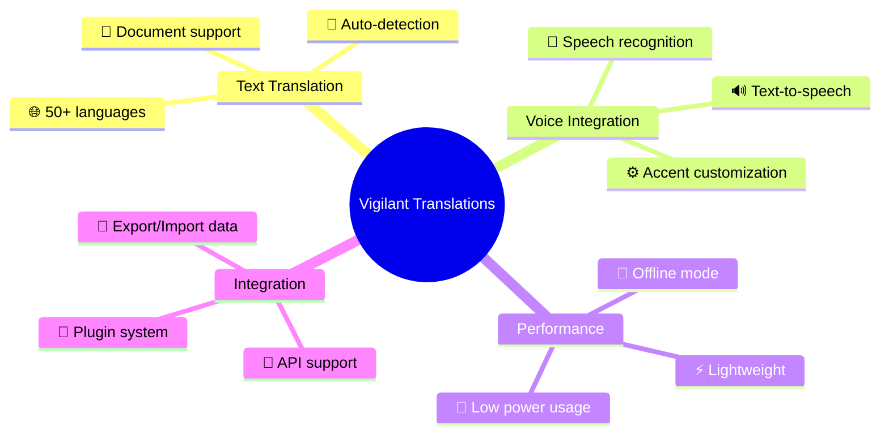

# 🌐 Vigilant Translations for Raspberry Pi

<div align="center">


[](https://www.python.org/)
[](LICENSE)
[](https://www.raspberrypi.org/)
[](https://github.com/elithaxxor/vigilant-translations)

**Break language barriers with a powerful, real-time translation application tailored for Raspberry Pi**

</div>

<p align="center">
Vigilant Translations is a feature-rich translation solution designed to run smoothly on Raspberry Pi. It supports 50+ languages, includes online/offline functionality, voice recognition, text-to-speech, and more—making it a one-stop multilingual communication platform.
</p>

---

## 📋 Table of Contents

- [✨ Features](#-features)  
- [🖼️ Screenshots](#-screenshots)  
- [🧩 Requirements](#-requirements)  
- [⚙️ Installation](#️-installation)  
- [🚀 Quick Start](#-quick-start)  
- [📱 Usage](#-usage)  
- [🏗️ Architecture](#️-architecture)  
- [🛠️ Troubleshooting](#️-troubleshooting)  
- [🤝 Contributing](#-contributing)  
- [📜 License](#-license)  
- [👤 Author](#-author)

---

## ✨ Features

<div align="center">



</div>

- **Multiple Modes**: Text, voice, and image-based translations (OCR).  
- **Auto Language Detection**: Automatically identifies the source language.  
- **Offline Support**: Use downloaded models for translation without internet.  
- **Speech Recognition & Synthesis**: Converse in different languages with ease.  
- **Extensive Language Coverage**: Translate across 50+ languages.  
- **Resource-Friendly**: Optimized for Raspberry Pi hardware constraints.  
- **Customizable**: Use different translation APIs and offline models.

---

## 🖼️ Screenshots

<div align="center">
  <p><strong>Main Translation Dashboard</strong></p>
  
  
  <p><strong>Voice Recognition Interface</strong></p>
  
  
  <p><strong>Language Selection</strong></p>
  
</div>

---

## 🧩 Requirements

### Hardware
- Raspberry Pi 3B+ or newer (recommended: Pi 4)
- Microphone (for voice recognition)
- Speakers or headphones (for text-to-speech)
- Minimum 16GB SD card
- Stable power supply

### Software
- Raspberry Pi OS (Bullseye or newer)
- Python 3.7+
- Key Python packages (installed automatically via `requirements.txt`):
  - `transformers`
  - `pytorch`
  - `flask`
  - `pyttsx3`
  - `SpeechRecognition`
  - `pillow`

---

## ⚙️ Installation

### Method 1: One-Line Script

```bash
curl -sSL https://raw.githubusercontent.com/elithaxxor/vigilant-translations/main_pi/install.sh | bash
```

### Method 2: Manual Steps

1. **Clone the repository**:
   ```bash
   git clone https://github.com/elithaxxor/vigilant-translations.git
   cd vigilant-translations/translation-app
   ```

2. **Set up a virtual environment** (optional but recommended):
   ```bash
   python3 -m venv venv
   source venv/bin/activate  # For Windows: venv\Scripts\activate
   ```

3. **Install dependencies**:
   ```bash
   pip install -r requirements.txt
   ```

4. **Download offline models** (optional):
   ```bash
   python3 download_models.py
   ```

5. **Configure settings**:
   ```bash
   cp config.example.json config.json
   # Edit config.json to set your API keys or offline mode
   ```

<details>
<summary>🗒️ Sample requirements.txt</summary>

```
transformers==4.18.0
torch==1.11.0
torchaudio==0.11.0
torchvision==0.12.0
flask==2.1.1
pyttsx3==2.90
SpeechRecognition==3.8.1
pillow==9.1.0
numpy==1.22.3
requests==2.27.1
python-dotenv==0.20.0
```
</details>

---

## 🚀 Quick Start

```bash
# Navigate to the project folder
cd vigilant-translations/translation-app

# Start the application
python3 main.py
```

- **Access the web interface**:  
  - On the same device: `http://localhost:5000`  
  - From another device on the same network: `http://<RASPBERRY_PI_IP>:5000`

---

## 📱 Usage

### Text Translation
1. Select source and target languages.  
2. Type or paste text into the input field.  
3. Click "Translate" to view results.  

### Voice Translation
1. Click the microphone icon (ensure mic is connected).  
2. Speak your phrase clearly.  
3. View recognized text and translated output.  
4. Optionally, use text-to-speech to hear the translation.

### Image Translation (OCR)
1. Upload an image with text.  
2. Adjust the crop area or settings if needed.  
3. Extract text and translate immediately.

---

## 🏗️ Architecture

<div align="center">

```mermaid
graph TB
    UI[Flask Web UI] --> TRANSLATE[Translation Engine]
    UI --> SPEECH[Voice Module]
    UI --> OCR[OCR Module]

    TRANSLATE --> ONLINE[Online API (Google, Microsoft, etc.)]
    TRANSLATE --> OFFLINE[Offline Models]

    SPEECH --> REC[Recognition]
    REC --> TRANSLATE

    OCR --> IMG[Image Processing]
    IMG --> TRANSLATE
```

</div>

- **Flask Web UI**: User-facing interface for translations and settings.  
- **Translation Engine**: Routes requests to either online translation APIs or local offline models.  
- **Speech Module**: Handles input from the microphone and output via text-to-speech.  
- **OCR Module**: Extracts text from images before translating.

---

## 🛠️ Troubleshooting

<details>
<summary>Common Issues & Solutions</summary>

**1. Memory Errors During Installation**  
   - Increase swap size on your Pi:  
     ```bash
     sudo dphys-swapfile swapoff
     sudo nano /etc/dphys-swapfile
     # Set CONF_SWAPSIZE=1024
     sudo dphys-swapfile setup
     sudo dphys-swapfile swapon
     ```

**2. API Key Not Working**  
   - Confirm that your `config.json` has the correct key under `"translation.providers"`.

**3. Microphone Not Detected**  
   - Check if the mic is properly recognized by your Pi:
     ```bash
     arecord -l
     ```
   - Update your ALSA settings or `config.json` accordingly.

**4. Offline Translation Fails**  
   - Ensure models are downloaded and stored in `models/` folder:
     ```bash
     python3 download_models.py --force
     ```
</details>

---

## 🤝 Contributing

Contributions are welcome! Help improve Vigilant Translations by:

1. **Forking** the repository.  
2. **Creating** a new branch: `git checkout -b feature/new-feature`.  
3. **Implementing** your improvements or bug fixes.  
4. **Testing** thoroughly to ensure stability.  
5. **Submitting** a Pull Request for review.

### Ideas & Requests
- Multi-user support with profiles.  
- Dynamic interface for advanced users.  
- Additional voice engines for diverse accents.  
- Enhanced offline mode for more languages.

---

## 📜 License

This project is licensed under the MIT License. See the [LICENSE](LICENSE) file for details.

---

## 👤 Author

<div align="center">
  
**Developed by [elithaxxor](https://github.com/elithaxxor)**

[](https://github.com/elithaxxor)

<p>Crafted with ❤️ for global communication</p>

</div>

---

<p align="center">
  
</p>

<div align="center">

**[Documentation](https://github.com/elithaxxor/vigilant-translations/wiki)** | 
**[Report Bug](https://github.com/elithaxxor/vigilant-translations/issues)** | 
**[Request Feature](https://github.com/elithaxxor/vigilant-translations/issues)**

<p align="center">
⭐ Star this repo if you found it useful! ⭐
</p>

</div>
